<div align="center">

# Kaleido

**Randomizer, éditeur de ROM et éditeur de sauvegardes Pokémon, tout-en-un et en français.**

Une seule application pour randomiser ta partie, modifier le jeu, puis gérer tes Pokémon :
boîtes, équipes stratégiques, légalité, Cadeaux mystère, Nuzlocke, calculs de combat…


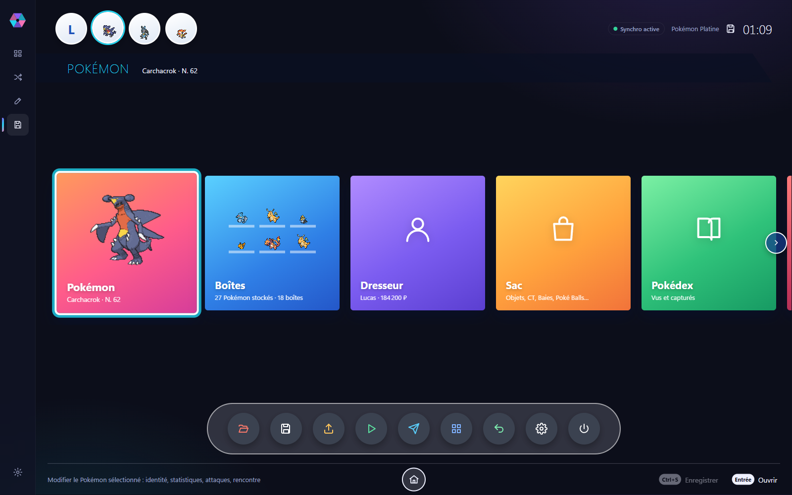

</div>

> [!IMPORTANT]
> Kaleido ne fournit **aucune ROM ni aucune sauvegarde**. Utilise uniquement des copies de tes propres
> cartouches. Projet de fan, non affilié à Nintendo, Game Freak ou The Pokémon Company.

## Sommaire

- [Ce que fait Kaleido](#ce-que-fait-kaleido)
- [Jeux pris en charge](#jeux-pris-en-charge)
- [Installation](#installation)
- [Visite guidée](#visite-guidée)
- [Fiabilité : comment c'est vérifié](#fiabilité--comment-cest-vérifié)
- [Développement](#développement)
- [Crédits](#crédits)

## Ce que fait Kaleido

| | |
|---|---|
| 🎲 **Randomizer** | Starters, sauvages, dresseurs, types, statistiques, talents, attaques, CT, objets, boutiques, Pokémon fixes et échanges, taux de chromatiques. Préréglages (Équilibré, Nuzlocke, Chaos total, Défi), seed et **code de partage** pour que tes amis jouent exactement la même partie. |
| ✏️ **Éditeur de ROM** | Statistiques de base, types, talents, taux de capture et attaques apprises par niveau de chaque Pokémon, réécrits dans une copie de la ROM. |
| 💾 **Éditeur de sauvegardes** | Gen 4 à 7, interface inspirée de PKHeX / TidalHeX : boîtes en glisser-déposer, fiche complète en 6 onglets, dresseur, sac, Pokédex, annuler / rétablir. |
| ⚔️ **Stratégie** | Équipes d'exemple de Smogon à importer en un clic, sets compétitifs par espèce, import / export Showdown, matrice de duels contre chaque dresseur du jeu. |
| ✅ **Légalité** | Vérification de chaque Pokémon, « Rendre légal » en un clic, base des rencontres (où et comment obtenir chaque espèce). |
| 🎁 **Cadeaux mystère** | Plus de 3 000 distributions officielles Gen 4 à 7, à ajouter directement à la sauvegarde ou à exporter. |
| 🪦 **Nuzlocke** | Suivi des routes, des captures et des morts, niveau maximum avant le prochain champion, détection des infractions. |
| 🏦 **Banque** | Range tes Pokémon hors des sauvegardes et transfère-les d'un jeu à l'autre (PK4 → PK7). |
| ▶️ **Jouer** | Détection des sauvegardes de melonDS et Azahar, bouton « Jouer » et synchronisation avec l'émulateur. |

Tout est en français, avec des bulles « i » qui expliquent chaque terme technique (IV, EV, PID, nature…).

## Jeux pris en charge

| Fonction | Jeux | État |
|---|---|---|
| Randomizer → ROM `.nds` | Diamant, Perle, Platine, HeartGold, SoulSilver, Noire, Blanche | ✓ (vérifié sur Diamant et SoulSilver) |
| Randomizer → mod LayeredFS ou `.3ds` reconstruit | Rubis Oméga, Saphir Alpha, X, Y | ✓ (vérifié sur Rubis Oméga et Y) |
| Randomizer → mod LayeredFS ou `.3ds` reconstruit | Soleil, Lune, Ultra-Soleil, Ultra-Lune | ✓ (vérifié sur Lune et Ultra-Soleil) |
| Éditeur de ROM | Diamant, Perle, Platine, HeartGold, SoulSilver, Noire, Blanche | ✓ (autres jeux : Pokédex en lecture seule) |
| Éditeur de sauvegardes | Gen 4 à 7 (DPPt, HGSS, NB, N2B2, XY, ROSA, SL, USUL) | ✓ |
| Switch | Let's Go, Épée / Bouclier, Légendes Arceus | plus tard |

Perle, Noire 2 / Blanche 2 et X / Y utilisent des emplacements de données
pas encore vérifiés sur une vraie ROM : ils sont marqués « Non vérifié » dans l'application.
En Gen 4, les emplacements ont été vérifiés sur Diamant et SoulSilver (Perle et HeartGold ne
diffèrent que par quelques archives, d'après UPR-ZX).
En Gen 7, les emplacements ont été vérifiés sur Lune et Ultra-Soleil (Soleil et Ultra-Lune ne
diffèrent que par l'archive des rencontres).

## Installation

1. Télécharge l'installateur `Kaleido_<version>_x64-setup.exe` dans les [Releases](https://github.com/mathis-ait/kaleido/releases),
   ou [compile-le toi-même](#développement).
2. Lance Kaleido et glisse une ROM (`.nds`, `.3ds`, `.cia`, dossier extrait) ou une sauvegarde dans la fenêtre.
3. Kaleido reconnaît le jeu, la langue et la révision, et propose ce qu'il peut faire avec.

Les sprites et les données en ligne (sets Smogon, équipes) sont téléchargés la première fois, puis gardés en cache :
l'application fonctionne ensuite hors ligne.

## Visite guidée

### Bibliothèque

Glisse tes fichiers : chaque ROM et sauvegarde est identifiée (jeu, langue, révision, contenu).

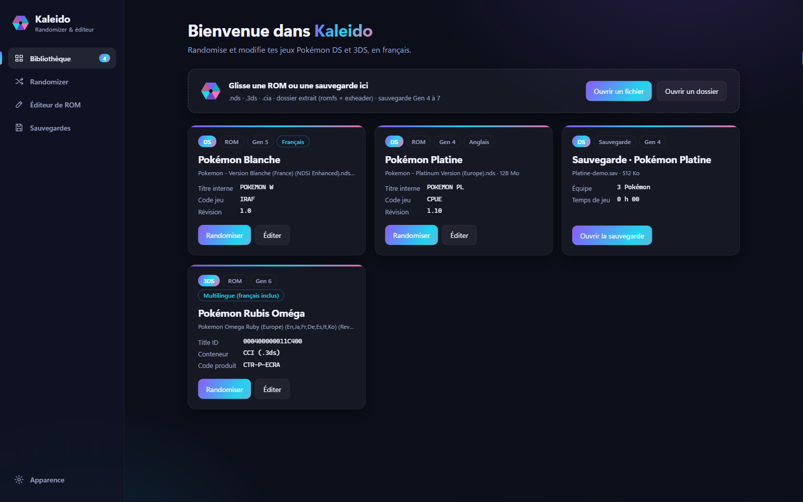

### Randomizer

Des onglets pour chaque partie du jeu, un résumé de tout ce qui change, et l'aperçu des starters
**avant** de générer : la seed détermine tout, l'aperçu est identique au résultat.

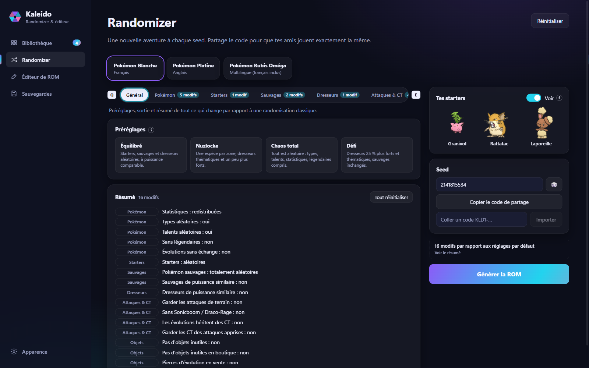

### Éditeur de ROM

Choisis un Pokémon, ajuste ses statistiques au curseur (le total et le radar suivent), ses types, ses talents,
son taux de capture et ses attaques apprises. « Enregistrer la ROM » écrit une copie : l'originale n'est jamais touchée.

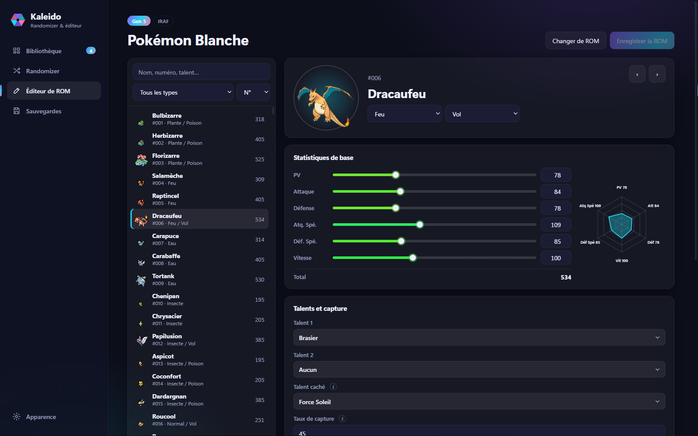

### Boîtes

Glisser pour déplacer, Maj pour copier, Alt pour écraser, Ctrl+Z pour annuler. La fiche du Pokémon
sélectionné s'affiche à droite ; une case vide permet d'en créer un.

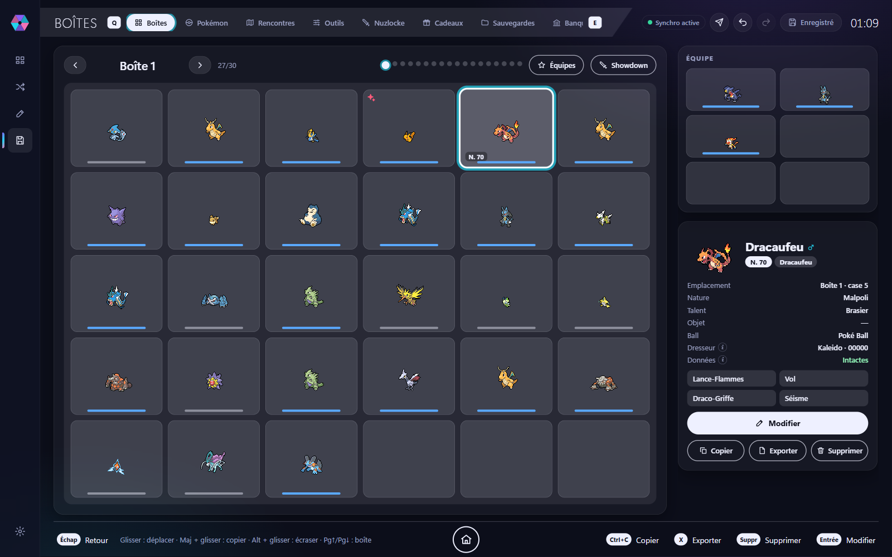

### Équipes stratégiques

Les équipes d'exemple publiées par Smogon pour chaque génération et chaque format (OU, UU, RU, LC, Doubles),
avec l'aperçu en français et l'import en un clic dans une boîte ou dans l'équipe.

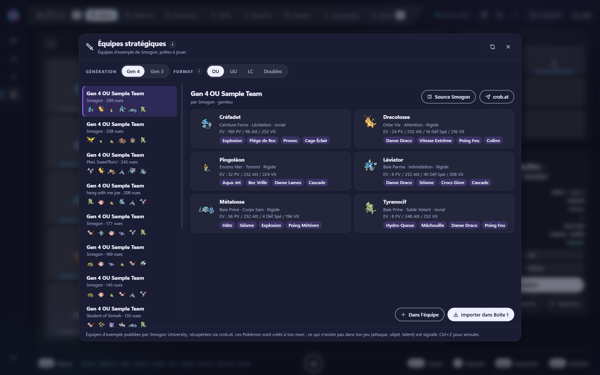

Depuis une case vide, « Sets stratégiques » propose les sets Smogon de l'espèce choisie et crée le Pokémon prêt à combattre.

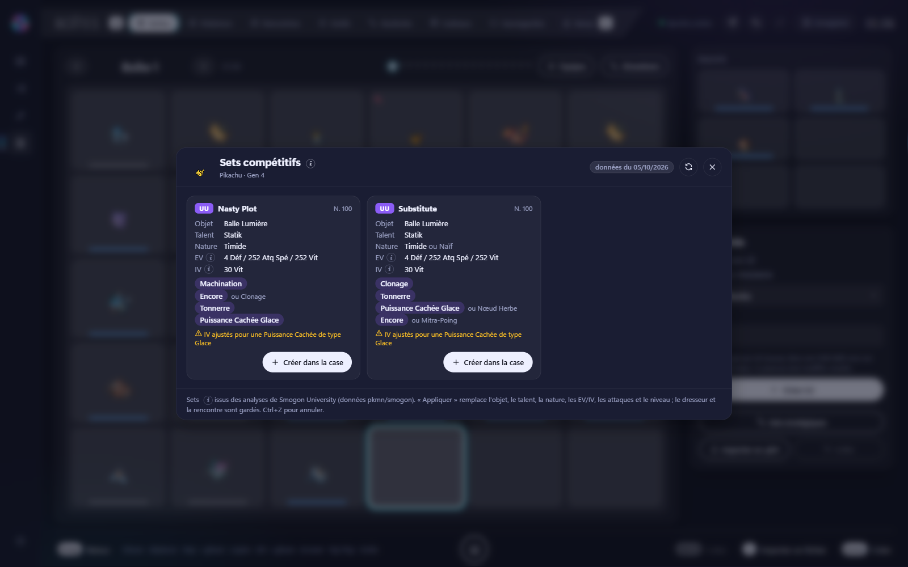

### Fiche Pokémon et légalité

Six onglets (aperçu, rencontre, statistiques, attaques, dresseur, extras), vérification de légalité
et correction automatique.

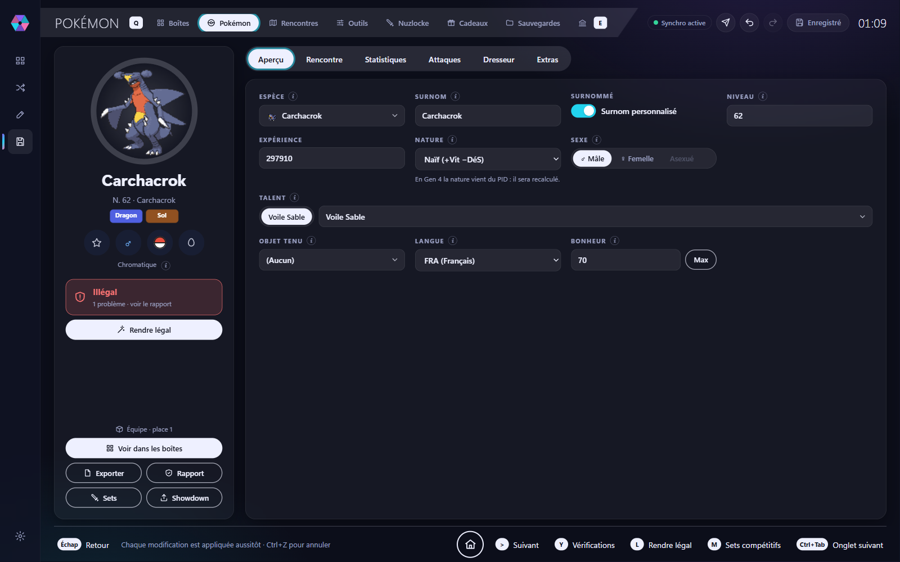

### Combat

Lie la ROM de ta partie et choisis un dresseur : la matrice calcule, pour chacun de tes Pokémon contre chacun des siens,
les dégâts et le nombre de coups pour mettre K.O., en tenant compte de la météo, des boosts et de l'Intimidation.

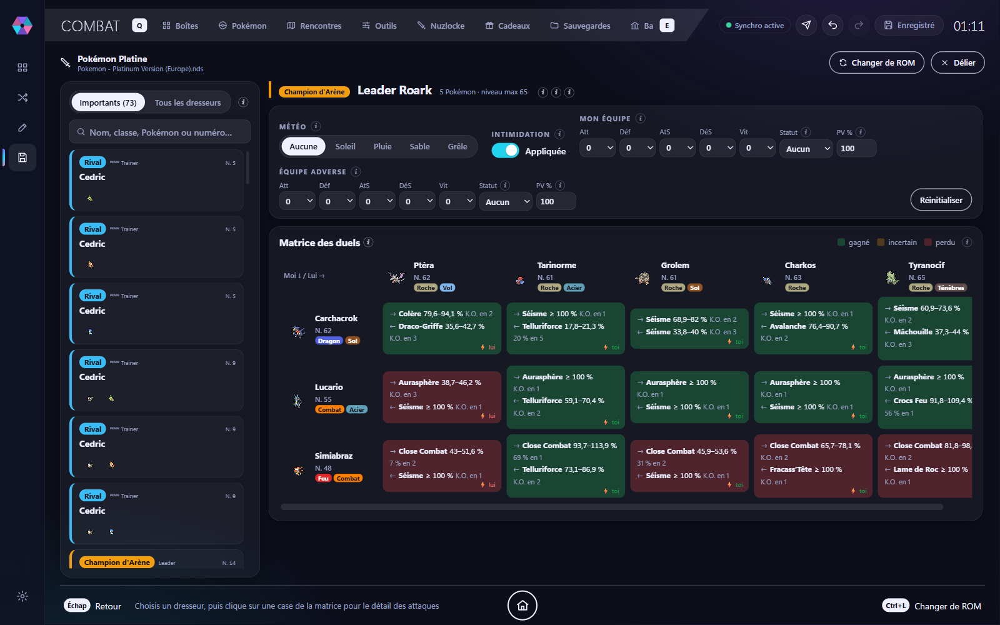

### Nuzlocke

Les routes dans l'ordre de l'histoire avec les Pokémon de **ta** ROM (randomisée ou non), les captures, les morts,
le niveau maximum avant le prochain champion et les infractions aux règles.

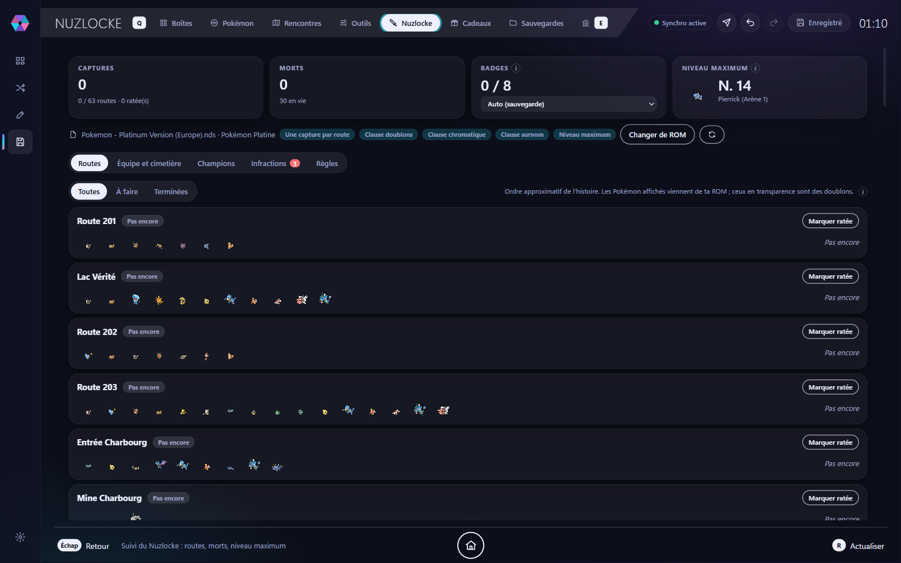

### Rencontres et Cadeaux mystère

Où trouver chaque Pokémon (herbes, surf, pêche, dons, échanges, événements), et la base des distributions officielles.

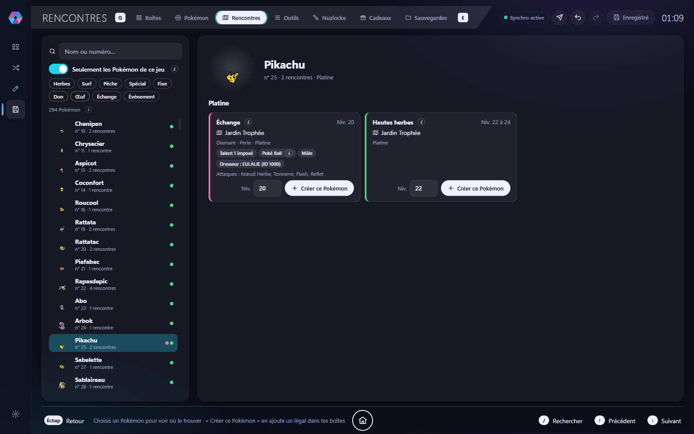

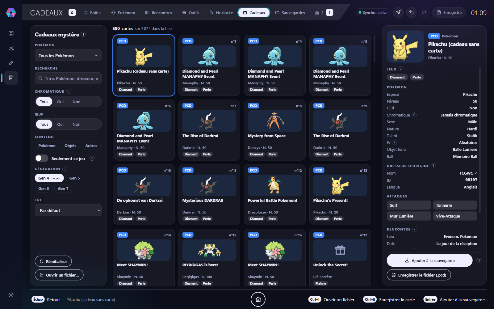

## Fiabilité : comment c'est vérifié

Chaque format est relu octet par octet après écriture, sur de vraies ROMs :

| Vérification | Platine (Gen 4) | Blanche FR (Gen 5) | Rubis Oméga (Gen 6) |
|---|---|---|---|
| ROM reconstruite à l'identique | ✓ | ✓ | — (sortie LayeredFS) |
| Archives NARC / GARC reconstruites à l'octet près | 215 / 215 | 237 / 237 | 298 / 298 |
| Overlays BLZ / entrées LZ11 décompressées | — (aucun compressé) | 230 / 230 | 21 907 LZ11, recompressées sans erreur |
| Fichiers de texte réécrits à l'octet près (FR) | 724 / 724 | 760 / 760 | 175 / 175 + 637 / 637 |
| Chaînes réencodées à l'identique (FR) | 46 053 / 46 053 | 56 703 / 56 703 | 33 909 + 11 538 |
| Pokédex (noms, types, statistiques, talents) | ✓ | ✓ | ✓ (721 espèces) |

Les ROMs « DSi Enhanced » presque pleines (comme Blanche) sont gérées : quand les fichiers modifiés ne tiennent
plus en fin de zone DS, Kaleido les range dans l'espace libre sans toucher aux structures fixes.
L'éditeur de sauvegardes suit le code de PKHeX et a été vérifié sur une vraie sauvegarde Soleil / Lune
(signature MemeCrypto recalculée).

> [!NOTE]
> Les ROMs générées sont validées par relecture complète, mais pas encore par une partie entière en jeu.
> Garde toujours une copie de tes fichiers d'origine.

## Développement

Prérequis : [Rust](https://rustup.rs), [Node.js](https://nodejs.org) LTS, Visual Studio Build Tools (C++).

```bash
cd app
npm install
npm run tauri dev      # application en mode développement
npm run tauri build    # installateur Windows (target/release/bundle)
```

Tests et vérifications :

```bash
cargo test --workspace
cargo clippy --workspace --all-targets
cargo fmt --all --check
cd app && npx vue-tsc --noEmit
```

Certains tests lisent de vraies ROMs : place-les dans `~/Documents/NDS & 3DS` (ou indique un dossier avec
`KALEIDO_ROMS`). Sans ROM, ces tests sont ignorés avec un message.

### Architecture

```
crates/formats   Formats bas niveau : NitroFS (ROM DS), NARC, LZ10/LZ11/BLZ, conteneurs 3DS,
                 RomFS (image ou dossier extrait), GARC, sortie LayeredFS
crates/core      Jeux, détection, textes Gen 4 à 7, données Pokémon, randomizer, éditeur de ROM,
                 sauvegardes, légalité, combat, Nuzlocke, Cadeaux mystère, Showdown
crates/cli       Outil `kaleido` pour inspecter et vérifier une ROM
app/             Interface Vue 3 (Vite)
app/src-tauri    Application de bureau Tauri, qui expose le moteur Rust à l'interface
```

### Outil en ligne de commande

```bash
cargo run --release -p kaleido-cli -- check     "rom.nds"                       # reconstruction, NARC, overlays
cargo run --release -p kaleido-cli -- species   "rom.nds"                       # Pokédex
cargo run --release -p kaleido-cli -- randomize "rom.nds" chaos 42 "sortie.nds" # randomiser avec un préréglage
cargo run --release -p kaleido-cli -- find      "rom.nds" a/0/0/2 Bulbizarre    # recherche dans les textes
cargo run --release -p kaleido-cli -- info3ds   "rom.3ds"                       # title ID, contenu du RomFS
cargo run --release -p kaleido-cli -- check3ds  "rom.3ds"                       # reconstruction de tous les GARC
```

<details>
<summary>Emplacements des données vérifiés dans Rubis Oméga / Saphir Alpha</summary>

| Données | Archive | Format |
|---|---|---|
| Textes du jeu (FR) | `a/0/7/4` (une archive par langue de `a/0/7/1` à `a/0/7/8`) | espèces n°98, talents n°37, capacités n°14, objets n°113, types n°18, dresseurs n°22, classes n°21 |
| Textes de l'histoire (FR) | `a/0/8/2` (`a/0/7/9` à `a/0/8/6`) | |
| Fiches « personal » | `a/1/9/5` | 0x50 octets par espèce/forme ; la dernière entrée est la table complète |
| Attaques par niveau | `a/1/9/1` | `u16 attaque, u16 niveau`…, fin `FFFF FFFF` |
| Évolutions | `a/1/9/2` | 8 × (`u16 méthode, u16 paramètre, u16 espèce`) |
| Attaques œuf | `a/1/9/0` | `u16 nombre`, puis `u16` attaques |
| Méga-évolutions | `a/1/9/3` | 3 × (`u16 forme, u16 méthode, u16 objet, u16 —`) |
| Rencontres sauvages | `a/0/1/3` | fichiers de zone `ZO` (LZ11), section 4 ; copie concaténée dans l'entrée 537 (`EN`) |
| Dresseurs | `a/0/3/6` (trdata), `a/0/3/8` (trpoke), `a/0/3/7` (classes) | voir `crates/core/src/ctr_rom.rs` |
| Starters | `DllField.cro` @ `0xF906C` (Rev 2 Europe) | table des dons, 0x24 octets par entrée |

</details>

<details>
<summary>Emplacements des données vérifiés dans Pokémon Y (X d'après l'Universal Pokémon Randomizer)</summary>

| Données | Archive | Format |
|---|---|---|
| Textes du jeu (FR) | `a/0/7/5` | espèces n°80, talents n°34, capacités n°13, objets n°96, types n°17, dresseurs n°21, classes n°20 |
| Fiches « personal » | `a/2/1/8` | 0x40 octets par espèce/forme ; la dernière entrée est la table complète |
| Attaques par niveau, évolutions | `a/2/1/4`, `a/2/1/5` | comme ROSA |
| Rencontres sauvages | `a/0/1/2` | zones `ZO` (LZ11), section 4 de 0x188 octets (94 emplacements) ; Pokémon qui tombent et buissons dans `DllField.cro` @ `0xF4270` / `0xF40CC` |
| Dresseurs | `a/0/3/8` (trdata, 0x14 octets), `a/0/4/0` (trpoke) | voir `crates/core/src/data/trainers.rs` |
| Starters | `DllField.cro` @ `0xF805C`, `DllPoke3Select.cro` | table des dons, 0x18 octets par entrée ; voir `randomizer/ctr_xy.rs` |
</details>

<details>
<summary>Emplacements des données vérifiés dans Soleil / Lune et Ultra-Soleil / Ultra-Lune</summary>

| Données | Archive | Format |
|---|---|---|
| Textes du jeu (FR) | `a/0/3/3` | S/L : espèces n°55, talents n°96, capacités n°113, objets n°36, types n°107, dresseurs n°105, classes n°106 ; Ultra : n°60, 101, 118, 40, 112, 110, 111 |
| Textes de l'histoire (FR) | `a/0/4/3` | écran des starters : n°41 (S/L), n°39 (Ultra) |
| Fiches « personal » | `a/0/1/7` | 0x54 octets ; la dernière entrée est la table complète |
| Attaques par niveau | `a/0/1/3` | comme ROSA |
| Évolutions | `a/0/1/4` | 8 × (`u16 méthode, u16 paramètre, u16 espèce, i8 forme, u8 niveau`) |
| Rencontres sauvages | `a/0/8/2` (Soleil, Ultra-Soleil), `a/0/8/3` (Lune, Ultra-Lune) | entrée `9 + 11 × zone` (LZ11, `EA`) : tables jour/nuit, rangée normale + 7 rangées SOS + SOS météo |
| Dresseurs | S/L : `a/1/0/5`, `a/1/0/6` ; Ultra : `a/1/0/6`, `a/1/0/7` | 0x14 octets, puis 0x20 octets par Pokémon |
| Starters | S/L : `a/1/5/5` ; Ultra : `a/1/5/9` (entrée 0) | table des dons, 0x14 octets par entrée |

</details>

### Feuille de route

- [x] Bibliothèque, détection des fichiers, thèmes
- [x] Formats DS et 3DS, textes Gen 4 à 7
- [x] Randomizer Diamant, Perle, Platine, HeartGold, SoulSilver, Noire, Blanche, ROSA et X / Y
- [x] Éditeur de ROM : Pokémon (statistiques, types, talents, capture, attaques apprises)
- [x] Éditeur de sauvegardes Gen 4 à 7, légalité, Cadeaux mystère, banque, Nuzlocke, combat, équipes Smogon
- [ ] Éditeur de ROM : dresseurs, rencontres sauvages, évolutions
- [ ] Préréglages IronMon, patchs de confort (texte rapide, Repousse réutilisable…)
- [x] Randomizer X / Y et Gen 7 (Soleil, Lune, Ultra-Soleil, Ultra-Lune)
- [ ] Randomizer Noire 2 / Blanche 2
- [ ] Rubans et souvenirs, Gen 1 à 3, Switch

## Crédits

Kaleido s'inspire de [Universal Pokémon Randomizer ZX](https://github.com/Ajarmar/universal-pokemon-randomizer-zx),
[pk3DS](https://github.com/kwsch/pk3DS), [pkNX](https://github.com/kwsch/pkNX), [PKHeX](https://github.com/kwsch/PKHeX)
et [TidalHeX](https://github.com/HydrosPlays/TidalHeX).

- **Données de jeu** de l'éditeur de sauvegardes (`crates/core/src/dex/`, `crates/core/data/pkhex/`) : ressources de
  [PKHeX](https://github.com/kwsch/PKHeX) de kwsch (GPLv3). Puissance, précision et catégorie des attaques :
  [PokeAPI](https://github.com/PokeAPI/pokeapi) (BSD-3-Clause).
- **Showdown** : format d'équipe de [Pokémon Showdown](https://github.com/smogon/pokemon-showdown) (MIT) et
  `ShowdownSet` de PKHeX (GPLv3).
- **Sets compétitifs** : analyses de [Smogon University](https://www.smogon.com), au format JSON de
  [pkmn/smogon](https://github.com/pkmn/smogon) (`data.pkmn.cc`, MIT).
- **Équipes d'exemple** : équipes publiées par Smogon University, récupérées via l'API publique de [crob.at](https://crob.at).
- **Sprites** : icônes de [pokesprite](https://github.com/msikma/pokesprite) (MIT) ; modèles 3D, pixel animés et artwork
  HOME des [sprites de Pokémon Showdown](https://play.pokemonshowdown.com/sprites/) et de leurs contributeurs.
  Ils ne sont pas inclus dans le dépôt : ils sont téléchargés à la demande puis mis en cache.

Pokémon © Nintendo, Game Freak, The Pokémon Company. Kaleido n'est ni affilié ni approuvé par eux.

## Licence

[GPL-3.0-or-later](LICENSE), comme les projets dont Kaleido s'inspire.
